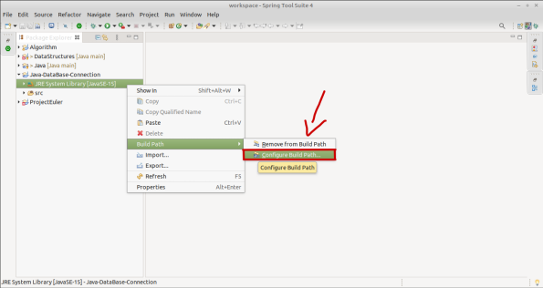
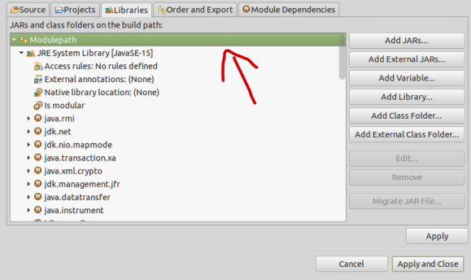
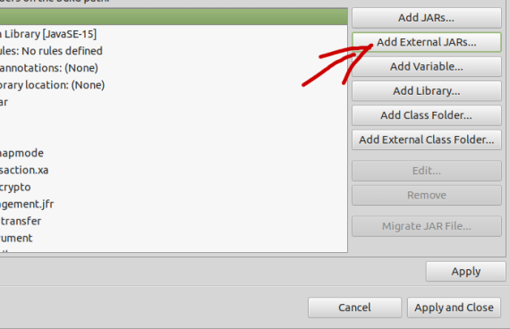
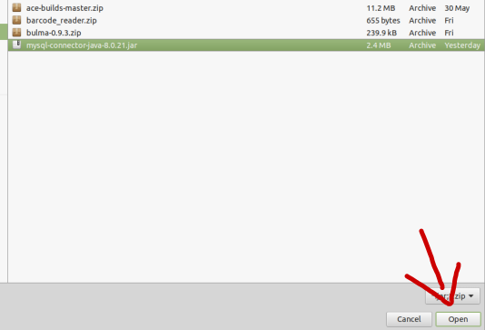
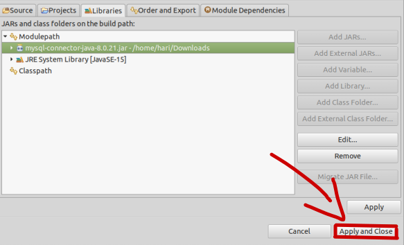

# Java-DataBase-Connection

* In this I had done simple Java databases connection example with MySQL

## Steps to work with this project

 - Install ***Java*** in your machine.
 - Install ***Eclipse*** on you machine.
 - Click  this [link](https://repo1.maven.org/maven2/mysql/mysql-connector-java/8.0.21/mysql-connector-java-8.0.21.jar) , to download **MySQL Connector/J** 8.0.21 package</br>
 - Click JRE System Libraries -> Build path -> Configure Build Path </br>
 </br></br>
 - Click **Modulepath** on  Libraries </br>
</br></br>
 - Click **Add external JARs** on right </br>
 </br></br>
 - Then select Mysql Connector/J which is download in step 3 and **click open** </br>
</br></br>
 - Finally click **Apply and Close** </br>
 </br></br>

 <hr>
 
 Now open Secretes.java
 
 ```
final protected static String username = "";
final protected static String password = "";
```
	
Fill above credentials 

 <hr>
 
  Now open student.sql and excute the SQL file in MySQL Server 
